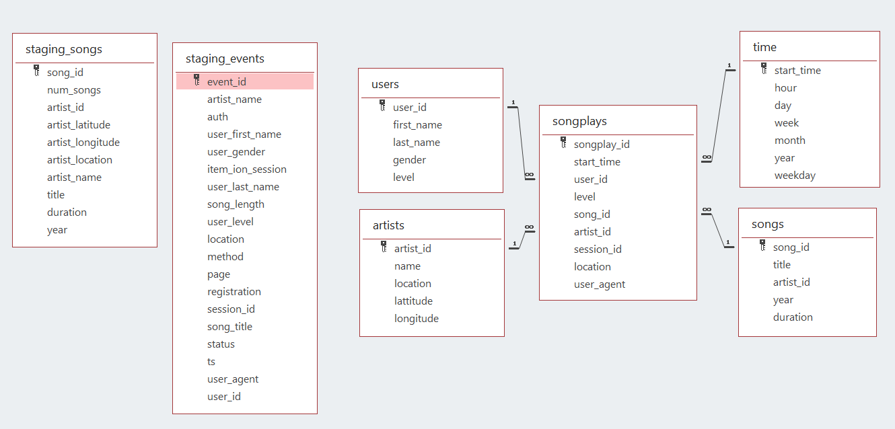

# Introduction 
A music streaming startup, Sparkify, has grown their user base and song database and want to move their processes and data onto the cloud. Their data resides in S3, in a directory of JSON logs on user activity on the app, as well as a directory with JSON metadata on the songs in their app.

As their data engineer, you are tasked with building an ETL pipeline that extracts their data from S3, stages them in Redshift, and transforms data into a set of dimensional tables for their analytics team to continue finding insights in what songs their users are listening to. You'll be able to test your database and ETL pipeline by running queries given to you by the analytics team from Sparkify and compare your results with their expected results.

# Project Description
In this project, you'll apply what you've learned on data warehouses and AWS to build an ETL pipeline for a database hosted on Redshift. To complete the project, you will need to load data from S3 to staging tables on Redshift and execute SQL statements that create the analytics tables from these staging tables.

# Project Dataset 
Datasets used in this project are provided in two public S3 buckets. One bucket contains info about songs and artists, the second bucket has info concerning actions done by users (which song are listening, etc.. ). The objects contained in both buckets are JSON files.
```
Song data: s3://udacity-dend/song_data
Log data: s3://udacity-dend/log_data
Log data json path: s3://udacity-dend/log_json_path.json
````
## Song Dataset
The first dataset is a subset of real data from the Million Song Dataset. Each file is in JSON format and contains metadata about a song and the artist of that song. The files are partitioned by the first three letters of each song's track ID. For example, here are filepaths to two files in this dataset.
```
song_data/A/B/C/TRABCEI128F424C983.json
song_data/A/A/B/TRAABJL12903CDCF1A.json
```
And below is an example of what a single song file, TRAABJL12903CDCF1A.json, looks like.
```
{"num_songs": 1, "artist_id": "ARJIE2Y1187B994AB7", "artist_latitude": null, "artist_longitude": null, "artist_location": "", "artist_name": "Line Renaud", "song_id": "SOUPIRU12A6D4FA1E1", "title": "Der Kleine Dompfaff", "duration": 152.92036, "year": 0}
```
## Log Dataset
The second dataset consists of log files in JSON format generated by this event simulator based on the songs in the dataset above. These simulate activity logs from a music streaming app based on specified configurations.

The log files in the dataset you'll be working with are partitioned by year and month. For example, here are filepaths to two files in this dataset.
```
log_data/2018/11/2018-11-12-events.json
log_data/2018/11/2018-11-13-events.json
```
# Database Schema and ETL
## Staging Table 
We have two staging tables which *copy* the JSON file inside the  **S3 buckets**.
+ **staging_songs** - info about songs and artists
+ **staging_events** - actions done by users (which song are listening, etc.. )

## Fact Table 
+ **songplays** - records in event data associated with song plays i.e. records with page `NextSong`

## Dimension Tables
+ **users** - users in the app
+ **songs** - songs in music database
+ **artists** - artists in music database
+ **time** - timestamps of records in **songplays** broken down into specific units

The database schema is shown as follows:


## ETL Pipeline
+ Created tables to store the data from `S3 buckets`.
+ Loading the data from `S3 buckets` to staging tables in the `Redshift Cluster`.
+ Inserted data into fact and dimension tables from the staging tables.

# Project Respository Files
## create_tables.py
A Python Script that creates the table by running SQL codes from sql_queries.py
## dwh.cfg
A file that contains the credential for accessing the Redshift Cluster
## etl.py
A Python Script that execute the ETL processes on the data
## sql_queries.py
A Python Script that contains all the necessary SQL codes which includes table creation and insertion

# Project Instruction
1. Fill `dwh.cfg` with AWS Redshift and IAM Credentials 
2. Execute `create_tables.py` file to create the required tables
3. Execute `etl.py` file to perform ETL processes and populate the tables

